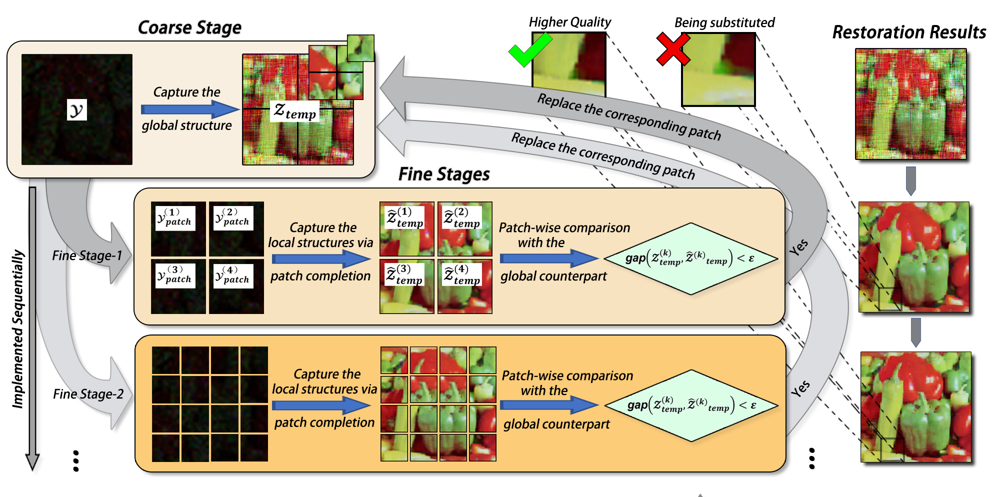
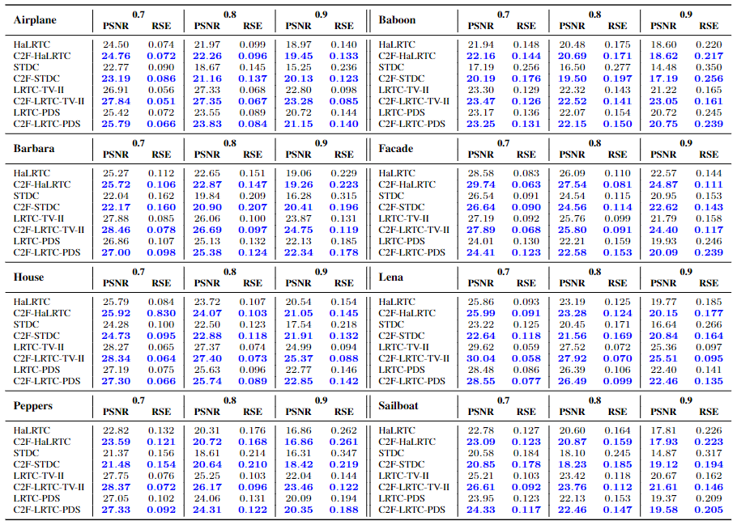
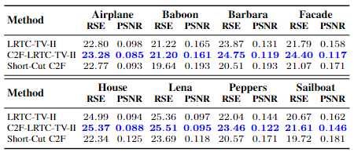

# Coarse to Fine: Image Restoration Boosted by Multi-Scale Low-Rank Tensor Completion Strategy (Link)


## C2F-LRTC


## Advantage
+ A general and intuitive C2F strategy is proposed, which effectively boosts the performance of existing LRTC methods by seeking proper local ranks for both the low- and high-rank parts, respectively.

+ Utilization of the data from both coarse and fine hierarchies, thus capturing both the global and local data structures simultaneously.

+ Extensive experiments and ablation study for validating C2F, which demonstrate the superiority of C2F in image completion tasks.

## Running Codes
Our experiments were all done on an Intel(R) Core(TM) i5-
6500 processor running at 3.2GHz with 16 GB RAM, and
the implementation platform is MATLAB 2020b.

### Installaltion
Download the C2F codes by running:
 ```
 git clone https://github.com/RuiLin0212/C2FLRTC.git
 ```

### Reproducing the Performance of C2F-LRTC Methods in Our Paper
After downloading the codes, and switching to the path with all the subfolders added, one can reproduce our results reported for the four C2F-LRTC methods by running the following files:
```
test_performance_STDC.m
test_performance_LRTC_TV_II.m
test_performance_SPC.m
test_performance_LRTV_PDS.m
```

Once finished, restored images and evaluation metrics for the whole image and every small patch in both coarse and fine stages will be stored in ```.mat``` files.

### Plugging in Other LRTC Methods and Completing New Images

If you want to try other LRTC methods with our proposed C2F scheme, please add the selected LRTC methods under the ```./C2FLRTC ``` path. Then you are supposed to modifying the following four codes blocks (taking ```test_performance_LRTV_TV_II.m``` as the basis for modification):

Firstly, you should initialize the propoer hyper-parameters for your selected LRTC method by modifiying the block below:
```
% initialize hyper-parameters for LRTC_TV_II (line 57 - 64)

N=3;
lambda=0.02;
alpha=[1/N, 1/N, 1/N];
beta=[1,1,0];  % which decides using LRTC-TV-II ([1,1,0]) or STDC ([0,0,0])

fprintf('-------------- LRTC_TV_II -------------------\n');
lambda_1=0.5;
lambda_2=1000;
```

Next, you are supposed to replace the LRTC_TV_II with the selected LRTC method for the coarse stage completion by modifying:
```
% coarse stage completion (line 87)

Z_TRLRTV2_temp=LRTC_TV_II(index_temp,value_temp, lambda_1, lambda_2 ,alpha, beta, size(B_pad), N ,300);
```

The third step is to modify how the hyper-parameters change during the sequencial fine stages, you are expected to modify the following block or you can delete this part if you wish the hyper-parameters stay the same during the whole completion process:
```
# hyper-parameters update (line 130 - 143)

if i<6
    lambda_1_temp=lambda_1;
    lambda_2_temp=lambda_2;
    alpha=[1/N, 1/N, 1/N]*(i);
else 
    lambda_1_temp=lambda_1/((2^3));
    lambda_2_temp=lambda_2/((2^(3))^2);
    
    B_temp_large=imresize(B_temp,[floor(size(B_temp,1)*2^(i-3)),floor(size(B_temp,2)*2^(i-3))],'box');
    
    [index_temp_large]=find(B_temp_large(:));
    value_temp_large=B_temp_large(index_temp_large);
    patch_size_temp=size(B_temp_large);
end
```

The final step is to replace the LRTC-TV-II methods with the choosen LRTC method in the fine stages, this can be achieved by rewriting the codes below:
```
% Fine stage completion (line 145 - 153)

if i<6
    %%%%%%%%%% LRTC completion %%%%%%%%%%
    Z_TRLRTV2_patch=LRTC_TV_II(index_temp,value_temp, lambda_1_temp, lambda_2_temp ,alpha, beta, patch_size, N ,100);
else
    %%%%%%%%%% LRTC completion %%%%%%%%%%
    Z_TRLRTV2_patch=LRTC_TV_II(index_temp_large,value_temp_large, lambda_1_temp, lambda_2_temp ,alpha, beta, patch_size_temp, N ,100);
    
    Z_TRLRTV2_patch=imresize(Z_TRLRTV2_patch,[size(B_temp,1),size(B_temp,2)]);
end
```


## Experimental Results

### Eight Benchmarks


### Pure LRTC vs. C2F-LRTC
Table below summarizes the comparison results of pure LRTC and their C2F version under different missing ratios. For easy reading, the C2F-LRTC results are marked blue, and are put below the corresponding pure LRTC method.



Figure below shows the restoration results of facade and sailboat under $90\%$ missing ratio. These two images are representative, since the image facade has regular patterns while the image sailboat contains both the details-lacking parts (e.g., the sky and the lake) and the complex objects (e.g., the trees and the boat). It is noticeable that C2F-LRTC restore both two kinds of images with richer details. In summary, C2F can steadily improve the performance of existing LRTC methods and retain more details.


### The Effectiveness of Gradual Refinement
we validate the effectiveness of the successive fine-grained completion by comparing the restoration results obtained by pure LRTC, C2F-LRTC, and the Short-Cut C2F-LRTC, which only contains the coarse stage at the beginning and the last fine stage with the smallest patches.

The results are displayed in the table below, where we employ the LRTC-TV-II algorithm and set the missing ratio as $90\%$. For the Short-Cut C2F, we set a larger patch replace threshold $\epsilon = 0.3$ to ensure that the newly completed patches in the last fine stage can replace their counterparts in the coarse stage. For the remaining hyper-parameters, we keep them the same as in the original C2F strategy.



### Local Rank Analysis
We also investigate the correctness of the setting in our method that we have assumed smaller local ranks along with decreasing patch sizes. We compute the average relative patch ranks (RPR) for patches of different sizes in the ground truth. The RPR is defined as the ratio between the number of singular values, which accounts for $90\%$ of the total singular values summation, and the patch size. Along this side, the patch size can be ignored when comparing the patch ranks.

 

## License
C2F is released under MIT License.


